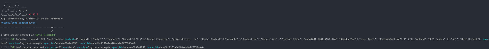

# logtrace

Is the Pixel8Labs library to generate the trace and inject it into a log.

## How to use

Install first by running:

```bash
go get github.com/pixel8labs/logtrace
go mod tidy
```

Initialize log & trace by calling:

```go
package main

import (
	"context"

	"github.com/pixel8labs/logtrace/log"
	"github.com/pixel8labs/logtrace/trace"
)

func main() {
	// Init log.
	// This step is actually optional and you can just provide APP_ENV and SERVICE_NAME in the env var.
	log.Init("service-name", "env")

	// Init trace.
	err := trace.InitTrace(context.Background())
	if err != nil {
		panic(err)
	}
	trace.Tracer("service-name")
	
	// Continue your application init here.
}
```

### Other Log Initializations

For enabling pretty print, we can use:

```go
log.Init("service-name", "env", log.WithPrettyPrint())
```

For enabling log forwarding to DataDog, we can use:

```go
log.Init("service-name", "env", log.WithDataDog("datadog-api-key", "datadog-log-intake-base-url"))
```

### Example on using in Cron

```go
package cron

import (
	"github.com/pixel8labs/logtrace/log"
	"github.com/pixel8labs/logtrace/trace"
)

func Run(ctx context.Context, app *application.App) {
	h := cron.NewHandler(app)

	err := trace.InitTrace(ctx)
	if err != nil {
		panic(err)
	}

	if _, err := c.AddFunc("@every 1m", func() {
		ctx, span := trace.StartSpan(ctx, "Health-Squad-Cron", "DeleteExpiredRefreshTokens")
		defer span.End()

		h.DeleteExpiredRefreshTokens(ctx)
	}); err != nil {
		log.Error(err, log.Fields{}, "Error on adding CRON job for DeleteExpiredRefreshTokens.")
		panic(err)
	}

	...
}

func (h *Handler) DeleteExpiredRefreshTokens(ctx context.Context) {
	log.Info(ctx, log.Fields{}, "Deleting expired refresh tokens")
	if err := h.RefreshTokenRepo.DeleteExpired(ctx); err != nil {
		log.Error(ctx, err, log.Fields{}, "Error when deleting expired refresh tokens")
	}
	log.Info(ctx, log.Fields{}, "Expired refresh tokens deleted")
}

```


### Example on using in Worker
```go
import (
  log "github.com/pixel8labs/logtrace/log"
  "github.com/pixel8labs/logtrace/trace"
)

func Run(ctx context.Context, app *application.App) {
  config := config.LoadGoogleCloud()
  
  err := trace.InitTrace(ctx)
  if err != nil {
    panic(err)
  }
  
  trace.Tracer("Health-Squad-Worker")

  ...

  subscriber := client.Subscription(config.SubscriptionID)
  err = subscriber.Receive(ctx, func(ctx context.Context, msg *pubsub.Message) {
    ctx, span := trace.StartSpan(ctx, "Health-Squad-Worker", "FetchFitbit")
    ...
  
    ...
  
    log.Info(ctx, log.Fields{"payload": payload}, "user fitbit data fetched successfully")
    msg.Ack()
	span.End()
  })
  if err != nil {
    log.Error(ctx, err, log.Fields{}, "unable to receive messages")
  }
  
  log.Info(ctx, log.Fields{}, "Stopping WORKERS...")
}
```


### Example on using in Server

See example [here](examples/echo/main.go)


